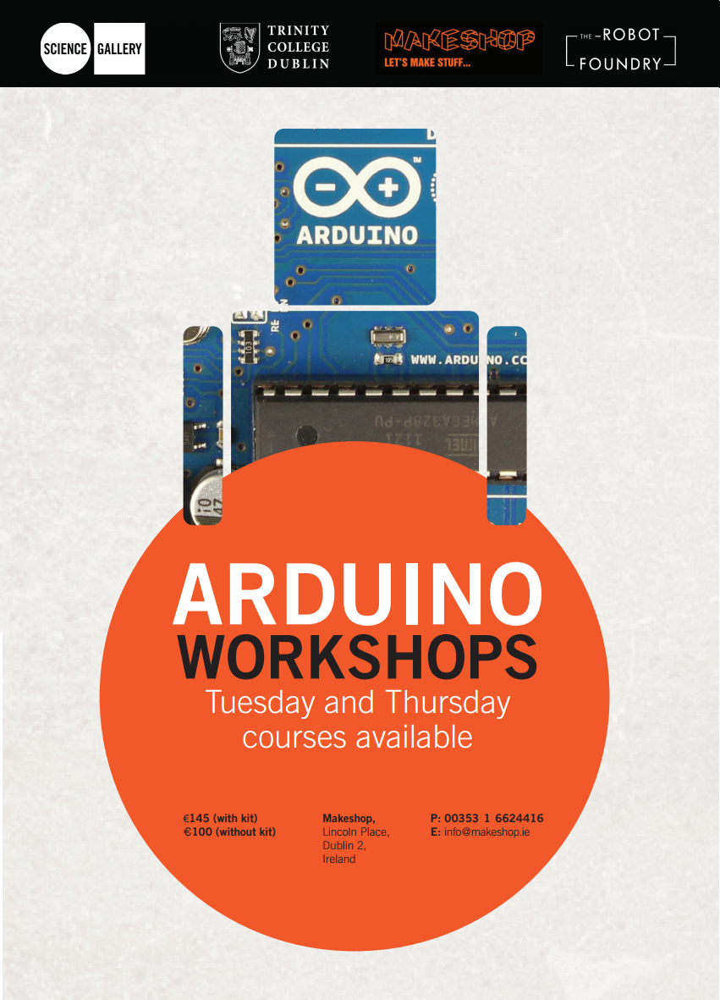

#www.theRobotFoundry.net
  
If you're interested in attending one of our courses just send us an email:
therobotfoundry@gmail.com  

###Sketches
Here's a collection of some of the sketches that we've worked on so far. This list will grow as the weeks progress.

- [Blink](#blink)  
-     [Loops](#loops)   
- [Traffic Lights](#traffic-lights)  
-     [Arrays](#arrays)  
- [Light Dependent Resistor](#ldr)  
-     [If Statements](#ifs)  

## <a name="blink"></a> Blink
This is, traditionally, the very first sketch that people write. All it does is turn the light (LED) on and off. Every Arduino sketch must have a `setup()` block and a `loop()` block. In the setup block all the pins you want to use in your circuit are setup, or initialised, to be either **INPUT** or **OUTPUT** pins. This is done using the `pinMode()` function. Please note that Arduino programming is case sensitive, so INPUT, Input, and input are all different things. To turn the LED on or off the `digitalWrite()` function is used. It takes two pieces of information, also known as parameters or arguments for the function. It needs to know what pin to work with and whether to turn it on or off.Finally,  the `delay()` function determines how long to wait before executing the next line of code & time is measured in miliseconds.
```C
void setup() {                
  // initialise pin 13 as an output.
  pinMode(13, OUTPUT);     
}

void loop() {
  digitalWrite(13, HIGH);   // set the LED on
  delay(1000);              // wait for a second
  digitalWrite(13, LOW);    // set the LED off
  delay(1000);              // wait for a second
}
```

This is a very simple MWE (minimum working example) which allows us to check that our code will compile and succesfully upload to our Arduino. However, it's not very robust and doesn't cope particulaly well with changes to the circuit. The SMS code below works better.


```C
/*
In this code we name the output pin "LED" and give it a value of pin 9.  
Our code now references a general pin name rather then a specific pin number.  
This means that if we need to change from pin 9 to any other pin we only have  
to make one change, and we can do this without the risk of breaking the rest  of our code.
*/

int LED = 9;            
int shortDelay = 200;
int longDelay = 500;

void setup(){
  pinMode(13, OUTPUT);
}

void loop(){

//morse code for letter "S"
 digitalWrite(LED, HIGH);
    delay(shortDelay);
 digitalWrite(LED, LOW);
    delay(shortDelay);
 digitalWrite(LED, HIGH);
    delay(shortDelay);
 digitalWrite(LED, LOW);
    delay(shortDelay);
 digitalWrite(LED, HIGH);
    delay(shortDelay);
 digitalWrite(LED, LOW);
    delay(shortDelay);

//morse code for letter "M"
 digitalWrite(LED, HIGH);
    delay(longDelay);
 digitalWrite(LED, LOW);
    delay(longDelay);
 digitalWrite(LED, HIGH);
    delay(longDelay);
 digitalWrite(LED, LOW);
    delay(longDelay);

//Morse code for "S"
 digitalWrite(LED, HIGH);
    delay(shortDelay);
 digitalWrite(LED, LOW);
    delay(shortDelay);
 digitalWrite(LED, HIGH);
    delay(shortDelay);
 digitalWrite(LED, LOW);
    delay(shortDelay);
 digitalWrite(LED, HIGH);
    delay(shortDelay);
 digitalWrite(LED, LOW);
    delay(shortDelay);

//Pause before going back to the begining of the loop
    delay(longDelay);
}

```
<a name="loops"></a>
###Loops
Generally when coding you want to be as concise as possible. If there are any patterns or repitition in the code, like in the SMS example above, you can usually make it shorter. In the coming weeks we'll look at using functions to do this for us, but for now we will reduce our code using a `for()` loop.
In order to create a `for()` loop you need to know four things. 
1.Where to start the loop
2. Where to finish the loop
3. How to move through the loop
4. What to do during each iteration, or each pass, through the loop.

The syntax of a `for()` loop looks something like the following:

```C
for(start value; end value; how to move through the loop){
  what to do each time the loop executes;
}
``` 
The most common way to start a loop is by declaring a variable and initialising it to 0. For example `for(int counter = 0;`. To set the end condition we can either hard-code in a value or reference some other piece of code. If we want to run the loop to stop before the counter gets to three we can use `for(int counter = 0; counter < 3;` Finally, we want to increase the value of the counter. To add two to our counter we would write `counter = counter + 2`. The `=` in most programming languages is for *assignment*. This means that the counter variable is set, or assigned, a value 2 greater than whatever value it is now. The most common increment is 1 and we could write `counter = counter + 1` but since this is so common there is a shorthand way of doing this which is `counter++`. The last thing we need to do is tell the loop what to do each time it executes. For this example we want to blink the LED. Putting it all together we get 
```C
//S
for(int counter = 0; counter < 3; counter++){
  digitalWrite(LED, HIGH);
  delay(200);
  digitalWrite(LED, LOW);
  delay(200);
}

//M
for(int counter = 0; counter < 2; counter++){
  digitalWrite(LED, HIGH);
  delay(500);
  digitalWrite(LED, LOW);
  delay(500);
}

//S
for(int counter = 0; counter < 3; counter++){
  digitalWrite(LED, HIGH);
  delay(200);
  digitalWrite(LED, LOW);
  delay(200);
}

//delay before starting all over again:
delay(1000);
```
So now we've gone from 40 lines of code to 26. We can (and will!) do better but that's not a bad start.

## <a name="traffic-lights"></a> Traffic Lights


Info to follow!

```C
/*
Simple traffic lights example, where each LED lights up sequentially

Code by Domhnall O'Hanlon. 2014.

*/

//giving the pins more suitable names
//this will make the code easier to read, 
//and changes faster to carry out
int GreenLED = 11;
int YellowLED = 10;
int RedLED = 9;

//same idea with as with the pins
//changing the delay requires making one change rather than 3!
int multiplier = 1000;
int secsToWait = 2;
int delayAmount = secsToWait * multiplier;


void setup(){
 pinMode(GreenLED, OUTPUT);
 pinMode(YellowLED, OUTPUT);
 pinMode(RedLED, OUTPUT);

}


void loop(){
  digitalWrite(RedLED, LOW);
  digitalWrite(GreenLED, HIGH);
  delay(delayAmount);
 
  digitalWrite(GreenLED, LOW);
  digitalWrite(YellowLED, HIGH);
  delay(delayAmount);

 digitalWrite(YellowLED, LOW);
 digitalWrite(RedLED, HIGH);
 delay(delayAmount); 
}

```

<a name="arrays"></a>
###Using Arrays

```C

/*
Traffic lights example, lighting LEDs sequentially....over and over again!

Code by Domhnall O'Hanlon. 2014.

*/

//create an array of LEDs, in this case the the numbers refer to pin numbers
//but arrays can be used to store any information.
int LEDs[] = {9,10,11};

//defining the delay amount as a variable for ease of reuse & reprogramming
int multiplier = 1000;
int secsToWait = 2;
int delayAmount = secsToWait * multiplier;


void setup(){
  //since all the pins are outputs we can declare this using a for loop.
  //using this approach we can setup any amount of pins using just two lines of code
 for(int i =0; i < sizeof(LEDs); i++){ 
  pinMode(LEDs[i], OUTPUT);
 }
}


void loop(){

  //by rights this should be wrapped in an IF statement, but it still works without being overly complicated
  for(int i = 0; i<sizeof(LEDs); i++){
    digitalWrite(LEDs[i],HIGH);    //1. starts with the ith element of the LEDs array and turns it on
    delay(delayAmount);            //2. leaves it on for a predetermined amount of time
    digitalWrite(LEDs[i], LOW);    //3. turns the light off
    }                              //4. until the loop as gone through all the LEDs it will go back to the beginning and do the same for the i+1th element.
}                                  //5. Once it finishes with the for() loop it goes back to the start of loop(), hence the slightly longer delay in going from green back to red.

```  

<a name="serial-monitor"></a>
###Serial Monitor

If we want to read or write information with the computer we can use the serial monitor. In order make use of this functionality we must add the `Serial.begin(9600);` function to the setup block of code. This tells the Arduino to use the serial monitor, with a baud rate of 9600. Once we have done this we can use a wide range of functions, such as `Serial.read()` and `Serial.write()` throughout our code. In the following example we allow the user to select which light to activate, based on thier keyboard input.

```C
/*
Traffic light code where the user selects which LED to illuminate based on key press

Code by Domhnall O'Hanlon. 2014.

*/

//giving the pins more suitable names
//this will make the code easier to read, 
//and changes faster to carry out
int GreenLED = 11;  //pin 1 = TX
int YellowLED = 10; //pin 0 = RX
int RedLED = 9;

//same idea with as with the pins
//changing the delay requires making one change rather than 3!
int multiplier = 100;
int interval = 2;
int delayAmount = interval * multiplier;

int keyPressed = 0;
int numBlinks = 3;

void setup(){
 Serial.begin(9600); 
  
 pinMode(GreenLED, OUTPUT);
 pinMode(YellowLED, OUTPUT);
 pinMode(RedLED, OUTPUT);

Serial.println("Please press \'r\' for Red, \'y\' for Yellow or \'g\' for Green."); 

}


void loop(){
  //only executes this code if something is sent from the serial monitor
  if(Serial.available() >0){
    
    //sets the keyPressed var to whatever the user has typed on their keyboard
    keyPressed = Serial.read(); 
    
    //checks for either lower or upper case and sets the lights accordingly.
    // || is used to denote the boolean operator, 'OR'
    // && is used for the 'AND' operator
    // single quites are used for chars and double quotes are used for Strings
    // NB: == denotes equivalence and = is used for assignment.
    if(keyPressed =='r' || keyPressed == 'R'){
     Serial.write(keyPressed); 
     digitalWrite(RedLED, HIGH);
     digitalWrite(YellowLED, LOW);
     digitalWrite(GreenLED,LOW);
    }
    
    else if(keyPressed =='y'||keyPressed == 'Y'){
     Serial.write(keyPressed); 
     digitalWrite(RedLED, LOW);
     digitalWrite(YellowLED, HIGH);
     digitalWrite(GreenLED,LOW);
    }
    
    else if(keyPressed =='g' || keyPressed == 'G'){
     Serial.write(keyPressed); 
     digitalWrite(RedLED, LOW);
     digitalWrite(YellowLED, LOW);
     digitalWrite(GreenLED, HIGH);
    }
    
    /*
    Again, not strictly necessary here, but it's always good practice use an else block to 
    look after all the other eventualities.
    In this piece of code ALL the LEDs blink repeatedly if an invalid key is pressed.
    numBlinks and delayAmount are global variables, defined at the very beginning of the code
    */
    else{
     int i=1;
     while (i<=numBlinks){
       digitalWrite(RedLED, HIGH);
       digitalWrite(YellowLED, HIGH);     
       digitalWrite(GreenLED,HIGH); 
       delay(delayAmount);
       digitalWrite(RedLED, LOW);
       digitalWrite(YellowLED, LOW);     
       digitalWrite(GreenLED,LOW);
       delay(delayAmount);
       //Serial.print(i); //I was using this while debugging.
   
       i++;
     }
         Serial.write(keyPressed);
    }
  }

}

```

<a name="ldr"></a>
##Light Dependent Resistor


<a name="ifs"></a>
###If Statements
Putting the LDR input values and the LED outputs together we can now get the lights to turn on or off based on the ambient light levels in the room.


##Thanks!
This page is made possible thanks to [Github Pages](https://pages.github.com) :octocat: